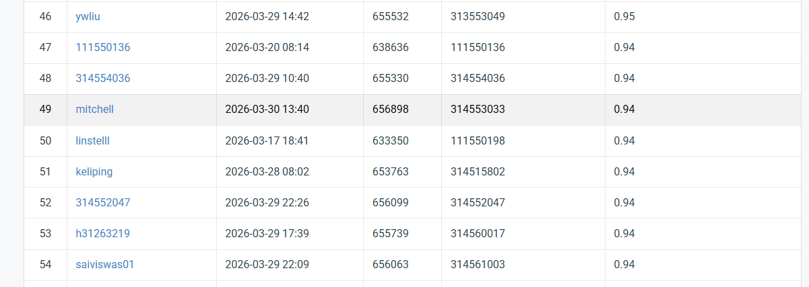

# NYCU Computer Vision 2026 HW1

- **Student ID:** 314553033
- **Name:** 蘇承泰

## Introduction
This repository contains the implementation for NYCU Computer Vision 2026 Homework 1 (Image Classification). The core model is built upon **ResNeXt50**, enhanced with a Convolutional Block Attention Module (**CBAM**) to adaptively refine feature maps. 

To effectively train the model and mitigate severe dataset imbalance, the following strategies are integrated into the pipeline:
- **Data Augmentation:** TrivialAugmentWide and RandomErasing.
- **Imbalance Handling:** WeightedRandomSampler.
- **Training Strategy:** Two-stage "Freeze-Thaw" fine-tuning.
- **Optimization:** Cross-Entropy Loss with Label Smoothing.

## Environment Setup
Follow the steps below to set up the Conda environment and install the required dependencies:

```bash
conda create -n resnet python=3.10 -y
conda activate resnet
pip install torch torchvision torchaudio --index-url https://download.pytorch.org/whl/cu121
pip install matplotlib tqdm scikit-learn tensorboard pandas seaborn
```
## Usage
### Directory Structure
Before running the code, please ensure your dataset and scripts are organized as follows:
``` Planetext
.
├── data/
│   ├── train/
│   ├── val/
│   └── test/
├── models/
├── utils/
├── train.py
└── inference.py
```
### Training
To train the model from scratch using the two-stage fine-tuning strategy, run:
``` bash
python train.py
```
### Inference
Before running inference, please open inference.py and modify the `OUTPUT_DIR` to point to your trained weights (e.g., `./outputs/[your_exp_name]`). Then, execute:
``` bash
python inference.py
```
This script will automatically generate the prediction.csv for submission, along with confusion matrix figure.
## Performance Snapshot

