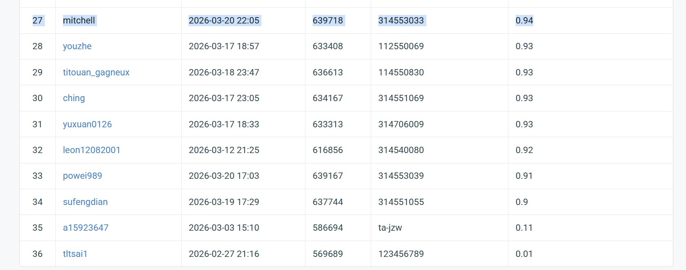

# NYCU Computer Vision 2026 HW1
- Student ID: 314553033
- Name: 蘇承泰
## Introduction
Breifly introduce your work here \
Resnet50 + CBAM + Trivial_Augmentation + freeze-thaw + label-smoothing + WeightedRandomSampler
## Enviroment Setup
How to install dependencies
``` bash
conda create -n resnet python=3.10 -y
conda activate resnet
pip install torch torchvision torchaudio --index-url https://download.pytorch.org/whl/cu121
pip install matplotlib tqdm scikit-learn tensorboard pandas
```
## Usage
### Training
How to train your model
``` bash
python train.py
```
### Inference
How to run inference \
In `infernce.py` \

``` bash
pyhton inference.py
```
## Performance Snapshot
Insert a screenshot of the leaderboard here

